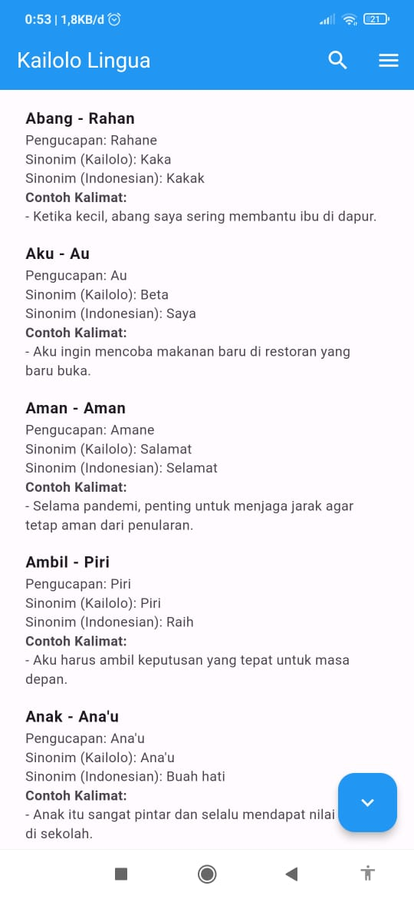
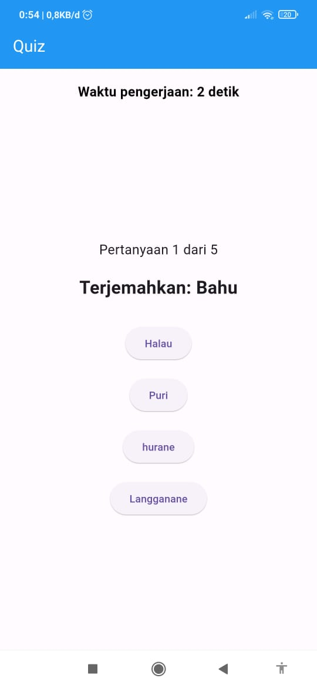
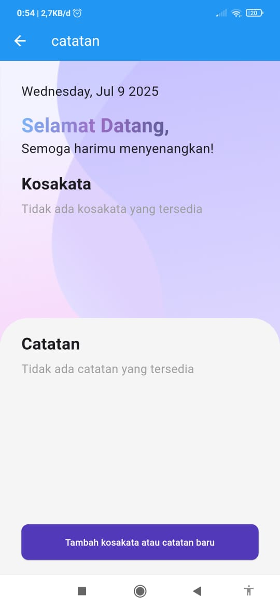
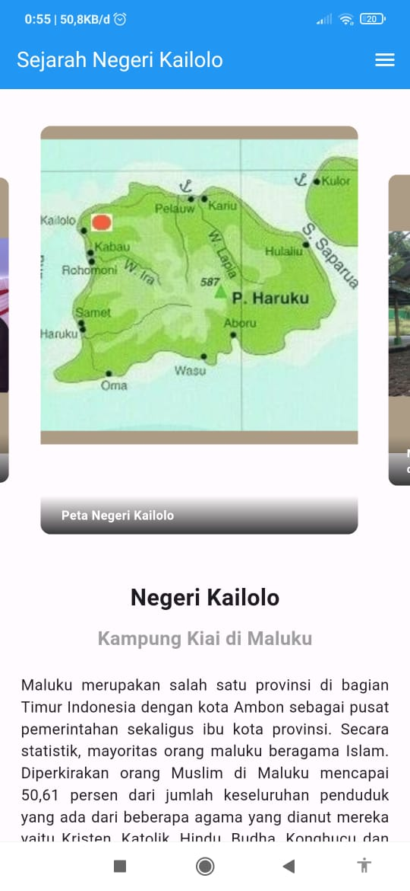
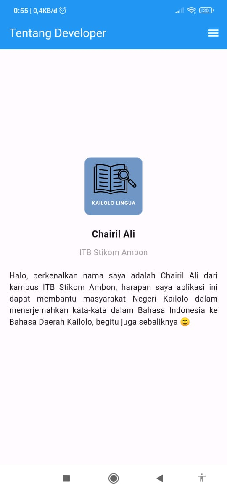

# Kailolo Lingua 🗣️

**Aplikasi Kamus Terjemahan Bahasa Daerah Kailolo - Indonesia**

Kailolo Lingua adalah aplikasi mobile berbasis Flutter yang dirancang untuk membantu masyarakat Negeri Kailolo dalam menerjemahkan kata-kata antara Bahasa Indonesia dan Bahasa Daerah Kailolo.

## 📸 Screenshots

<div align="center">
  
</div>

### 🏠 Halaman Utama (Kamus)

<div align="center">
  
</div>

### 🧠 Quiz Interaktif

<div align="center">
  
</div>

### 📝 Catatan Personal

<div align="center">
  
</div>

### 📚 Sejarah Negeri Kailolo

<div align="center">
  
</div>

### 👨‍💻 Tentang Developer

<div align="center">
  
</div>

## 📱 Fitur Utama

### 🔍 Kamus Digital

- **Pencarian Dua Arah**: Terjemahan dari Bahasa Indonesia ke Kailolo dan sebaliknya
- **Pencarian Real-time**: Fitur pencarian yang responsif dengan hasil instan
- **Informasi Lengkap**: Setiap kata dilengkapi dengan:
  - Pengucapan (pronunciation)
  - Sinonim dalam bahasa Kailolo
  - Sinonim dalam bahasa Indonesia
  - Contoh kalimat penggunaan
- **Scroll Navigation**: Tombol navigasi untuk scroll ke atas/bawah dengan mudah
- **Database Lengkap**: Lebih dari 297 kata dalam database kamus

### 🧠 Quiz Interaktif

- **Pengaturan Kustomisasi**:
  - Pilih jumlah soal (1-297 soal)
  - Atur waktu per soal (1-60 detik)
  - Input nama pengguna
- **Sistem Penilaian**: Evaluasi kemampuan terjemahan dengan skor real-time
- **Timer**: Batasan waktu untuk setiap pertanyaan
- **Feedback Langsung**: Hasil quiz dengan analisis performa

### 📝 Catatan Personal

- **Manajemen Tugas**: Buat, edit, dan hapus catatan pribadi
- **Kategori Tugas**:
  - Tugas prioritas
  - Tugas harian
- **Interface Modern**: UI yang menarik dengan background kustom
- **Timestamp**: Pencatatan waktu pembuatan dan modifikasi
- **Local Storage**: Penyimpanan catatan secara lokal

### 📚 Informasi Budaya

- **Sejarah Negeri Kailolo**: Informasi lengkap tentang sejarah dan budaya
- **Galeri Foto**: Carousel slider dengan gambar-gambar bersejarah:
  - Peta Negeri Kailolo
  - Makam bersejarah
  - Dokumentasi acara adat
- **Informasi Developer**: Profil pengembang aplikasi dengan animasi teks

## 🛠️ Teknologi yang Digunakan

### Framework & Language

- **Flutter**: Framework utama untuk pengembangan cross-platform
- **Dart**: Bahasa pemrograman

### Dependencies Utama

```yaml
dependencies:
  flutter: sdk
  animated_text_kit: ^4.2.2 # Animasi teks
  carousel_slider: ^4.2.1 # Slider gambar
  cupertino_icons: ^1.0.6 # Icon iOS
  font_awesome_flutter: ^10.8.0 # Icon Font Awesome
  http: ^1.2.1 # HTTP requests
  intl: ^0.19.0 # Internationalization
  json_annotation: ^4.8.1 # JSON serialization
  path_provider: ^2.1.3 # File system paths
  shared_preferences: ^2.2.2 # Local storage
  url_launcher: ^6.2.5 # Launch URLs
```

## 📁 Struktur Proyek

```
lib/
├── main.dart                    # Entry point aplikasi
├── models/
│   └── word.dart               # Model data kata
├── pages/
│   ├── catatan/                # Fitur catatan
│   │   ├── catatan.dart
│   │   ├── tambah_catatan.dart
│   │   ├── edit_catatan.dart
│   │   ├── models/
│   │   └── storage_service.dart
│   ├── quiz.dart               # Fitur quiz
│   └── sejarah_kailolo.dart    # Halaman sejarah
├── components/
│   └── utils.dart              # Utility functions
└── about_dev.dart              # Halaman tentang developer

assets/
├── images/                     # Gambar dan logo
├── I2Kdatabase.json           # Database kamus
└── KamusKailolo.json          # Data kamus utama
```

## 🚀 Instalasi dan Setup

### Prasyarat

- Flutter SDK (>=3.3.0 <4.0.0)
- Dart SDK
- Android Studio / VS Code
- Emulator Android atau perangkat fisik

### Langkah Instalasi

1. **Clone Repository**

   ```bash
   git clone <repository-url>
   cd dictionary
   ```

2. **Install Dependencies**

   ```bash
   flutter pub get
   ```

3. **Generate Files** (jika diperlukan)

   ```bash
   flutter packages pub run build_runner build
   ```

4. **Run Aplikasi**
   ```bash
   flutter run
   ```

### Build untuk Production

**Android APK:**

```bash
flutter build apk --release
```

**Android App Bundle:**

```bash
flutter build appbundle --release
```

## 📊 Data Kamus

Aplikasi menggunakan file JSON sebagai database kamus dengan struktur:

```json
{
  "ind": "kata dalam bahasa Indonesia",
  "kai": "kata dalam bahasa Kailolo",
  "pron": ["pengucapan"],
  "kai_syns": ["sinonim dalam Kailolo"],
  "ind_syns": ["sinonim dalam Indonesia"],
  "sents": ["contoh kalimat"]
}
```

## 🎨 Fitur UI/UX

- **Material Design**: Mengikuti guidelines Material Design
- **Responsive Layout**: Adaptif untuk berbagai ukuran layar
- **Dark/Light Theme**: Mendukung tema terang
- **Smooth Animations**: Animasi yang halus dan menarik
- **Intuitive Navigation**: Navigasi yang mudah dipahami

## 🔄 Fitur Offline

- **Local Storage**: Data kamus disimpan secara lokal
- **Offline Access**: Akses kamus tanpa koneksi internet
- **Auto Sync**: Sinkronisasi otomatis saat online

## 👨‍💻 Developer

**Chairil Ali**  
ITB Stikom Ambon

_"Harapan saya aplikasi ini dapat membantu masyarakat Negeri Kailolo dalam menerjemahkan kata-kata dalam Bahasa Indonesia ke Bahasa Daerah Kailolo, begitu juga sebaliknya 😊"_

## 📄 Lisensi

Proyek ini dikembangkan untuk kepentingan edukasi dan pelestarian budaya Negeri Kailolo.

## 🤝 Kontribusi

Kontribusi untuk pengembangan aplikasi ini sangat diterima. Silakan:

1. Fork repository
2. Buat branch fitur baru
3. Commit perubahan
4. Push ke branch
5. Buat Pull Request

## 📞 Kontak

Untuk pertanyaan atau saran, silakan hubungi chairilali13@gmail.com atau +6282238482847.

---

**Kailolo Lingua** - Melestarikan Bahasa, Menjaga Budaya 🏛️
