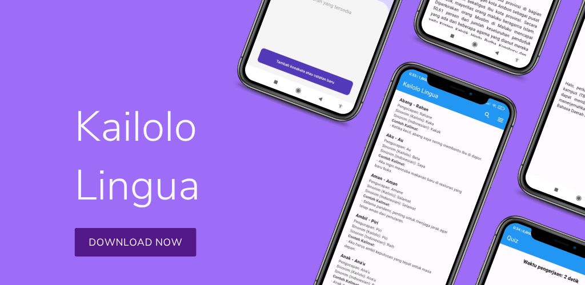

# Kailolo Lingua 🗣️

**Kailolo Regional Language - Indonesian Translation Dictionary App**

Kailolo Lingua is a Flutter-based mobile application designed to help the people of Kailolo Village translate words between Indonesian and Kailolo Regional Language.

## 📸 Screenshots

<div align="center">
  
</div>

### 🏠 Home Page (Dictionary)

<div align="center">
  
</div>

### 🧠 Interactive Quiz

<div align="center">
  
</div>

### 📝 Personal Notes

<div align="center">
  
</div>

### 📚 Kailolo Village History

<div align="center">
  
</div>

### 👨‍💻 About Developer

<div align="center">
  
</div>

## 📱 Main Features

### 🔍 Digital Dictionary

- **Bidirectional Search**: Translation from Indonesian to Kailolo and vice versa
- **Real-time Search**: Responsive search feature with instant results
- **Complete Information**: Each word includes:
  - Pronunciation
  - Synonyms in Kailolo language
  - Synonyms in Indonesian language
  - Usage example sentences
- **Scroll Navigation**: Navigation buttons for easy scrolling up/down
- **Complete Database**: More than 297 words in the dictionary database

### 🧠 Interactive Quiz

- **Custom Settings**:
  - Choose number of questions (1-297 questions)
  - Set time per question (1-60 seconds)
  - User name input
- **Scoring System**: Translation ability evaluation with real-time scores
- **Timer**: Time limit for each question
- **Instant Feedback**: Quiz results with performance analysis

### 📝 Personal Notes

- **Task Management**: Create, edit, and delete personal notes
- **Task Categories**:
  - Priority tasks
  - Daily tasks
- **Modern Interface**: Attractive UI with custom background
- **Timestamp**: Recording of creation and modification time
- **Local Storage**: Local note storage

### 📚 Cultural Information

- **Kailolo Village History**: Complete information about history and culture
- **Photo Gallery**: Carousel slider with historical images:
  - Kailolo Village map
  - Historical tombs
  - Traditional ceremony documentation
- **Developer Information**: Developer profile with text animations

## 🛠️ Technology Stack

### Framework & Language

- **Flutter**: Main framework for cross-platform development
- **Dart**: Programming language

### Main Dependencies

```yaml
dependencies:
  flutter: sdk
  animated_text_kit: ^4.2.2 # Text animations
  carousel_slider: ^4.2.1 # Image slider
  cupertino_icons: ^1.0.6 # iOS icons
  font_awesome_flutter: ^10.8.0 # Font Awesome icons
  http: ^1.2.1 # HTTP requests
  intl: ^0.19.0 # Internationalization
  json_annotation: ^4.8.1 # JSON serialization
  path_provider: ^2.1.3 # File system paths
  shared_preferences: ^2.2.2 # Local storage
  url_launcher: ^6.2.5 # Launch URLs
```

## 📁 Project Structure

```
lib/
├── main.dart                    # Application entry point
├── models/
│   └── word.dart               # Word data model
├── pages/
│   ├── catatan/                # Notes feature
│   │   ├── catatan.dart
│   │   ├── tambah_catatan.dart
│   │   ├── edit_catatan.dart
│   │   ├── models/
│   │   └── storage_service.dart
│   ├── quiz.dart               # Quiz feature
│   └── sejarah_kailolo.dart    # History page
├── components/
│   └── utils.dart              # Utility functions
└── about_dev.dart              # About developer page

assets/
├── images/                     # Images and logos
├── I2Kdatabase.json           # Dictionary database
└── KamusKailolo.json          # Main dictionary data
```

## 🚀 Installation and Setup

### Prerequisites

- Flutter SDK (>=3.3.0 <4.0.0)
- Dart SDK
- Android Studio / VS Code
- Android emulator or physical device

### Installation Steps

1. **Clone Repository**

   ```bash
   git clone <repository-url>
   cd dictionary
   ```

2. **Install Dependencies**

   ```bash
   flutter pub get
   ```

3. **Generate Files** (if needed)

   ```bash
   flutter packages pub run build_runner build
   ```

4. **Run Application**
   ```bash
   flutter run
   ```

### Build for Production

**Android APK:**

```bash
flutter build apk --release
```

**Android App Bundle:**

```bash
flutter build appbundle --release
```

## 📊 Dictionary Data

The application uses JSON files as dictionary database with structure:

```json
{
  "ind": "word in Indonesian",
  "kai": "word in Kailolo",
  "pron": ["pronunciation"],
  "kai_syns": ["synonyms in Kailolo"],
  "ind_syns": ["synonyms in Indonesian"],
  "sents": ["example sentences"]
}
```

## 🎨 UI/UX Features

- **Material Design**: Following Material Design guidelines
- **Responsive Layout**: Adaptive for various screen sizes
- **Dark/Light Theme**: Support for light theme
- **Smooth Animations**: Smooth and attractive animations
- **Intuitive Navigation**: Easy-to-understand navigation

## 🔄 Offline Features

- **Local Storage**: Dictionary data stored locally
- **Offline Access**: Dictionary access without internet connection
- **Auto Sync**: Automatic synchronization when online

## 👨‍💻 Developer

**Chairil Ali**  
ITB Stikom Ambon

_"I hope this application can help the people of Kailolo Village in translating words from Indonesian to Kailolo Regional Language, and vice versa 😊"_

## 📄 License

This project is developed for educational purposes and cultural preservation of Kailolo Village.

## 🤝 Contributing

Contributions to the development of this application are very welcome. Please:

1. Fork the repository
2. Create a new feature branch
3. Commit your changes
4. Push to the branch
5. Create a Pull Request

## 📞 Contact

For questions or suggestions, please contact chairilali13@gmail.com or +6282238482847.

---

**Kailolo Lingua** - Preserving Language, Maintaining Culture 🏛️
